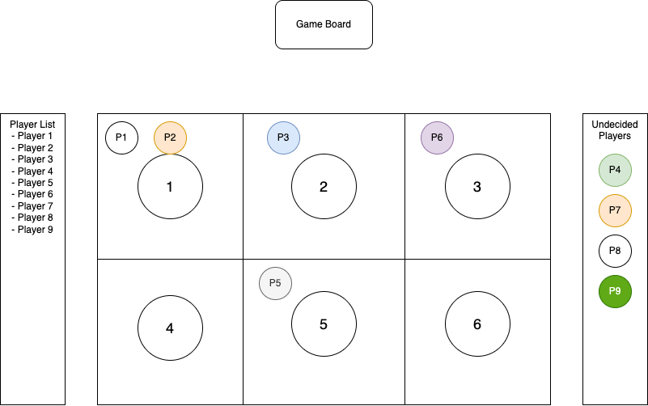

# Project: Postcode Api

## Trello Board

- https://trello.com/b/04C3sRcg/crab-go-grab

## Demo & Snippets

- ***

## Requirements / Purpose

- Crab Go Grab is a multiplayer game loosely based on the game "Hoo Hey How" https://en.wikipedia.org/wiki/Hoo_Hey_How . Players can select one of 6 options, and a dice is rolled. When the dice is rolled, a player who has selected an option which has the same outcome as the dice wins, and players who have selected the right option lose.

## Build Steps

---

## Design Goals / Approach

---

## Features

---

## Known issues

## Future Goals

- Deployment
- ***

## Edge Cases

-

## Change logs

### 2/03/2025 - Started Project

- Created README, mock ups for the UI, and kanban board

## What did you struggle with?

- Understanding websockets and implementing them
