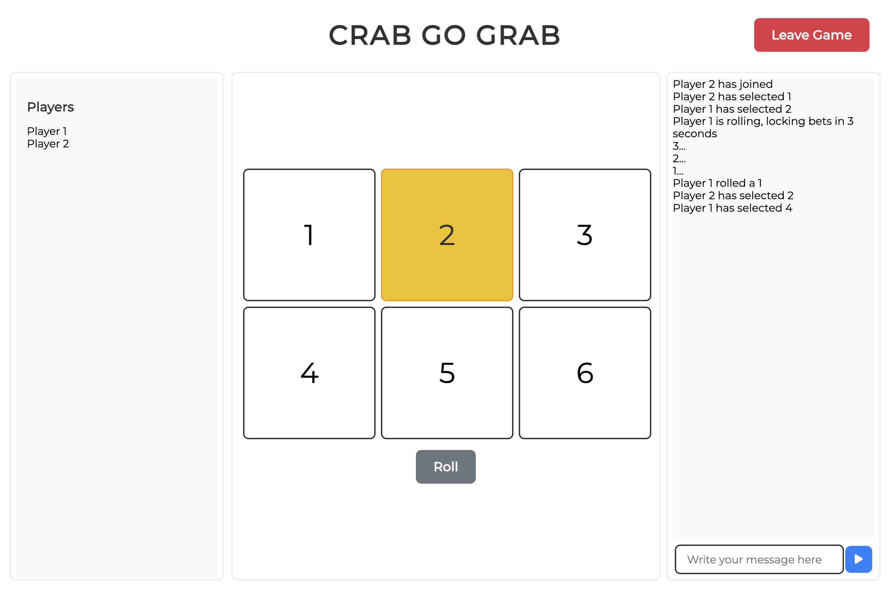
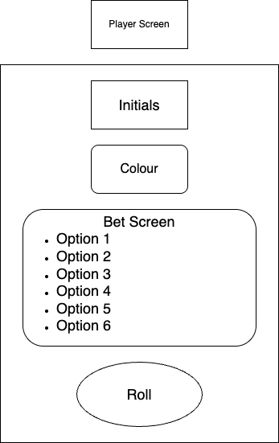

# Project: Crab Go Grab

## Trello Board

- https://trello.com/b/04C3sRcg/crab-go-grab

## Demo & Snippets



### Mock-Up of Board


### Mock-Up for Screen



- ***

## Requirements / Purpose

- Crab Go Grab is a multiplayer game loosely based on the game "Hoo Hey How" https://en.wikipedia.org/wiki/Hoo_Hey_How . Players can select one of 6 options, and a dice is rolled. When the dice is rolled, a player who has selected an option which has the same outcome as the dice wins, and players who have selected the right option lose.

## Features

- Real time multiplayer
- Real time synchronised countdowns
- Client notifications

## Design Goals

- The goal of this project was to create a multiplayer game that can be accessed publicly by web browsers. Players can join/leave a lobby, and in the lobby, each player can make a selection from six option. This selection is visible to other players, and a player can initiate a countdown. After the countdown has completed, each player will recieve an outcome based on a randomly selected option from the server.

- Upon completion there would be a greater understanding of implementation of websockets, use of AI in development and deployment.

---

## Approach

- As this is a multiplayer game I believed that use of websockets, with a separation between the front end and back end was more appropriate in comparison to a RESTful API.

- The use of AI tools were used to develop this project in order to develop a better understanding of future use cases. To get a better understanding I tried three different strategies towards using AI:
  - Asking for implementation ideas and implementing them myself
  - Creating prompts to produce code, entering what was generated, and further prompting if the code did not work as intended
  - Using agents

## Findings/Learnings

- As learning to use AI was the focus of this project I will mainly talk about my experiences towards the use of each approach, as well as my opinions of the advantages and shortcomings of each strategy.

### Asking for examples/ideas and manually implementation

- It's to no surprise that this strategy will produce less code than the other two listed, but results in higher quality code. I adopted this approach to begin with, as I was new to using websockets. Following guides on Springboot allowed for me to create a live chatting application, but through going through documentation/help forums I was unable to find any defined methods of separating the server and the client as the official guide on Springboot hosted their front end as static resources in the server itself.
- Through a prompt of asking how to separate a backend and frontend for a websocket application and adapting the ideas to fit the needs of this project I was able to implement a separation between client and server and while this implementation took longer than other features in this project, I haven't had to go back and fix things. I would recommend adapting this strategy when learning how to do things for the first time as the slower, more methodical approach coupled with the ability for AI to explain concepts can accelerate understanding of newer concepts.

### Asking for a prompt, pasting in the code, and prompting if there are further errors

- In my opinion this strategy can save lots of time and can waste lots of time if you are inexperienced/not careful. As an example this is great for styling components, as making prompts to make tweaks to its appearance is quicker than going into the css and making changes yourself. Even more time is saved, when you have multiple components which adopt a similar design.
- In contrast there can be some times where upon receiving an error, the AI focuses on the wrong thing when trying to debug an issue. One example of this was when I was trying to deploy the backend on an EC2 instance. I was given this shell script to run to deploy the application:

```shell
#!/bin/bash

# Set variables
APP_NAME="app.jar"
APP_DIR=~/app
BACKUP_DIR=$APP_DIR/backups
LOG_FILE=$APP_DIR/logs/application.log

# Create required directories
mkdir -p $APP_DIR/{backend,frontend,logs,backups}

# Stop existing application
if [ -f $APP_DIR/backend/application.pid ]; then
    pid=$(cat $APP_DIR/backend/application.pid)
    kill $pid || true
    rm $APP_DIR/backend/application.pid
    echo "Stopped existing application"
fi

# Backup current version
timestamp=$(date +%Y%m%d_%H%M%S)
mkdir -p $BACKUP_DIR/$timestamp
mv $APP_DIR/backend/*.jar $BACKUP_DIR/$timestamp/ 2>/dev/null || true
mv $APP_DIR/frontend/* $BACKUP_DIR/$timestamp/ 2>/dev/null || true
echo "Created backup in $BACKUP_DIR/$timestamp"

# Start Spring Boot application
cd $APP_DIR/backend
if [ ! -f "$APP_NAME" ]; then
    echo "Error: $APP_NAME not found in $(pwd)"
    echo "Directory contents:"
    ls -l
    exit 1
fi

echo "Starting application: $APP_NAME"
nohup java -jar "$APP_NAME" \
    --spring.profiles.active=prod \
    > $LOG_FILE 2>&1 & echo $! > $APP_DIR/backend/application.pid

# Verify application started
sleep 5
if ! ps -p $(cat $APP_DIR/backend/application.pid) > /dev/null; then
    echo "Error: Application failed to start"
    echo "Last 50 lines of log:"
    tail -n 50 $LOG_FILE
    exit 1
fi

# Configure and restart Nginx
if [ -f ~/app/nginx/default.conf ]; then
    sudo cp ~/app/nginx/default.conf /etc/nginx/conf.d/default.conf
    if ! sudo nginx -t; then
        echo "Error: Nginx configuration test failed"
        exit 1
    fi
    sudo systemctl restart nginx
else
    echo "Warning: Nginx configuration file not found"
fi

echo "Deployment completed successfully"
echo "To view logs: tail -f $LOG_FILE"
```

- While this script looked like a quality block of code to begin with the .jar file could never be located. Upon prompting AI to troubleshoot this they wanted to confirm that I had properly uploaded the relevant files, if the instance had the correct ip listed, if the instance was running, then asking for me to try use a wildcard for the filename, then changing that back into a specific name. Until I pointed out that the script moves the files into backup before trying to run them instead of copying them instead essentially I was going back and forth between non-solutions and adding uneccesary bloat. This leads me to believe that AI struggles more in situations where external factors need to be taken into account, as there are times where it fixates on factors which it thinks is causing issue and at the same there are times where it ignores the surrounding environment of the issue. I think this strategy can be extremely efficient in lightweight tasks, but should be met with more scrutiny when dealing with unfamiliar concepts or working with code with multiple dependencies.

### Use of agents

- Due to a combination of time constraints and based on experiences previously mentioned I did not spend that much time using agents. I had prompted to split the webhook into smaller, specialised components, and the AI agent proceeded to update the webhook, and all components which used said webhook and broke all existing functionality. I can still chalk this due to inexperience with writing better prompts and not having a cleaner codebase but my current opinion is that the technology of the AI model that I used was not advanced enough to successfully refactor a slightly complicated codebase. As a result I believe that personally I think my ownly usecase for agents is for creating a lightweight codebase from scratch.

### Conclusion

- Currently I don't view AI as an all-in-one solution, but instead as something closer to a programming tool/framework. I believe that the scope of the task and the knowledge of the user matters as much as the level of technology behind the AI model. I think if I had more experience, and was more deliberate with my prompts I would spent so much time debugging.

---

## Known issues

- The single webhook contains a large amount of responsibilities/dependencies and is difficult to test for
- UI on certain resolution breakpoints does not display properly

## Future Goals

- Deployment
- Multiple lobbies
- Refactor of client services/webhook
- Mobile/smaller resolution friendly UI
- Visual indication of other player selections
- Backend persistence of player selections
- Animal and images to represent the board selection

## Edge Cases

- Two players can still join if they have the same name

## Change logs

### 2025-06-10

- Implemented testing
- Implemented a player list

### 2025-06-09

- Implemented consistent UI styling
- Added responsive button styling
- Improved chat message display

### 2025-05-22

- Initial implementation of game functionality
- Added countdown system for dice rolls
- Implemented roll locking mechanism
- Added player selection broadcast
- Added real-time roll status updates

### 2025-05-02

- Created initial project files
- Added player screen mockups
- Added titles for mockups
- Set up basic project structure

## What did you struggle with?

- Understanding websockets and implementing them
- Managing state across multiple components
- Handling real-time updates
- Testing
- Deployment
- Implementing synchronous countdown across multiple clients
